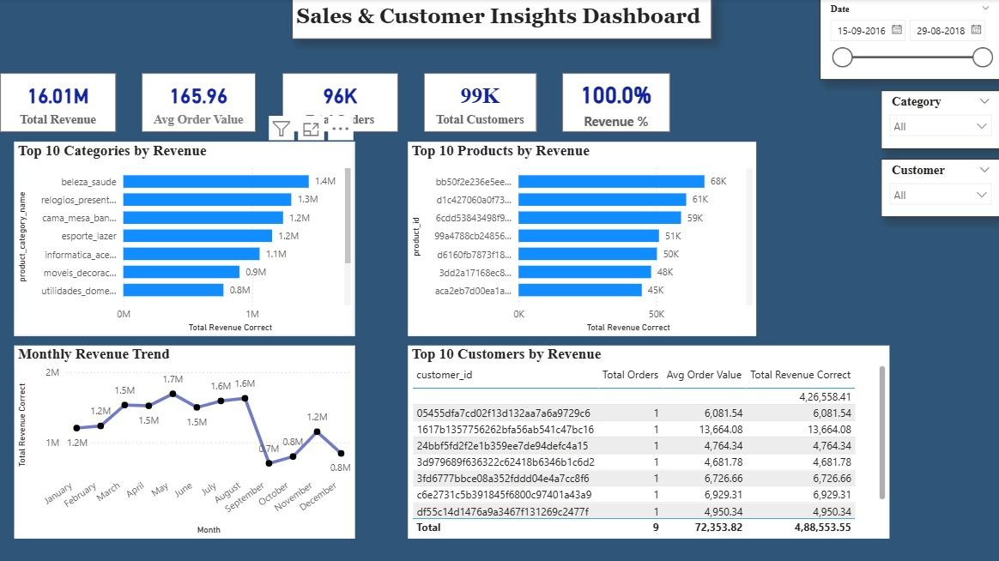

# 📊 Sales & Customer Insights Dashboard

## 📌 Overview

This project analyzes e-commerce sales data using Power BI to uncover key insights into revenue trends, customer behavior, and product performance.

---

## 🎯 Business Objective

* Identify top-performing product categories and products
* Analyze customer purchasing behavior
* Track monthly revenue trends
* Support business decision-making with data insights

---

## 🛠️ Tools & Technologies

* Power BI
* SQL
* Excel

---

## 📊 Dashboard Preview

---

## 📁 Project Structure

* **docs/** → BRD, FRD, NFRD
* **sql/** → SQL analysis queries
* **dashboard/** → Power BI file (external link)

---

## 📂 Dataset & Dashboard Access

Due to file size limitations, files are hosted externally:

👉 Dashboard (.pbix): https://drive.google.com/drive/folders/1nHvFR19KTqadxst6PEAoCTfadGqvYtnC?usp=drive_link

👉 Dataset: https://drive.google.com/drive/folders/1Ceq3Vza5ybtLzRNUdE-U84WLTTHYNFUm?usp=drive_link

---

## 🚀 Key Insights

* A few product categories contribute significantly to total revenue
* Customer spending is concentrated among top buyers
* Monthly revenue shows fluctuations indicating seasonal trends

---

## 📈 Outcome

This project demonstrates end-to-end data analysis including data cleaning, SQL querying, and interactive dashboard creation to generate business insights.

